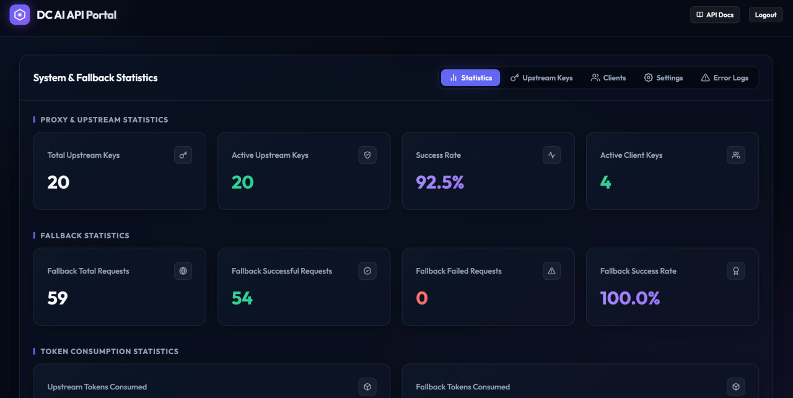
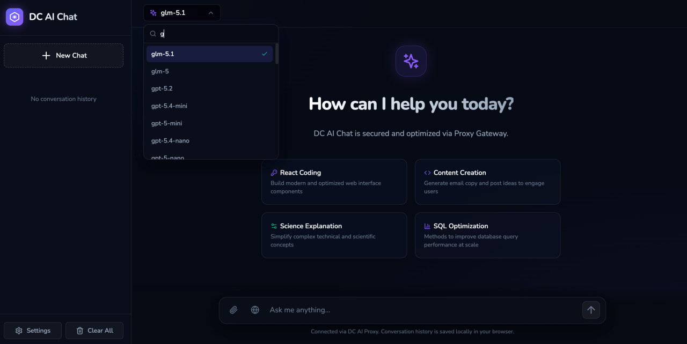

# DC AI API Proxy

[English](README.md) | Tiếng Việt

[](https://golang.org)
[](https://www.sqlite.org/)
[](LICENSE)

Một API Proxy hiệu năng cao, bền bỉ được phát triển bằng **Go**, được thiết kế để luân phiên (rotate) nhiều API key nguồn cấp (upstream API keys), phân phối tải request, tự động kiểm tra tình trạng hoạt động (health check) của key, và cung cấp một bảng quản trị web (admin dashboard) trực quan cùng giao diện chat client đầy đủ tính năng.

<table align="center">
  <tr>
    <td align="center" width="50%">
      
      <br />
      <sub>Bảng điều khiển Admin</sub>
    </td>
    <td align="center" width="50%">
      
      <br />
      <sub>Giao diện Chat Client</sub>
    </td>
  </tr>
</table>

---

## 🚀 Tính Năng Chính

* **Hỗ trợ Đa Giao thức**: Cung cấp các endpoint tương thích với các định dạng **OpenAI**, **Gemini Native**, và **Claude Native** formats, tự động biên dịch định dạng request theo thời gian thực.
* **Luân phiên Key & Phân phối Tải**: Tự động luân phiên các API key đang hoạt động bằng chiến lược Round-Robin dựa trên model và giao thức được máy khách yêu cầu.
* **Tự động Chuyển vùng & Hạ nhiệt (Cooldown)**: Tự động thử lại (retry) theo thời gian thực khi xảy ra lỗi kết nối với key nguồn cấp. Đưa các key bị giới hạn tần suất (429) hoặc lỗi kết nối (5xx) vào trạng thái hạ nhiệt (cooldown) trước khi khôi phục an toàn.
* **Hàng đợi Ghi Cơ sở Dữ liệu Đồng thời Cao**: Sử dụng hàng đợi ghi WAL an toàn luồng (thread-safe) và không chặn (non-blocking) để ghi chép thống kê và lượng token tiêu thụ mượt mà ở hiệu suất cao.
* **Kiểm tra Hoạt động & Theo dõi Độ trễ**: Kiểm tra độ hợp lệ của các key khi khởi động hệ thống và ghi nhận độ trễ phản hồi thực tế, hiển thị trực quan trên trang quản trị.
* **Bảng Quản trị Web Bảo mật**: Trang điều khiển glassmorphism tích hợp để quản lý client key, upstream key, các cấu hình dự phòng (fallback settings) và hiển thị trực quan số liệu thống kê sử dụng theo thời gian thực.
* **Giao diện Chat Client**: Giao diện web tương thích thiết bị di động (`/chat`) hỗ trợ tải lên tệp đa phương thức (multimodal uploads), đa ngôn ngữ (EN/VI), tự động cuộn thông minh, và hiển thị log suy nghĩ (thought log) có thể thu gọn.

---

## 📂 Cấu Trúc Dự Án

```bash
dc-ai-api/
├── main.go            # Điểm khởi đầu ứng dụng & Router engine Go 1.22 hỗ trợ wildcard
├── proxy.go           # Logic chuyển tiếp cốt lõi, streaming SSE và luân phiên key
├── store.go           # Kết nối cơ sở dữ liệu SQLite & Hàng đợi ghi đồng thời cao
├── admin.go           # Các API bảng quản trị và thao tác CRUD
├── search.go          # API Tìm kiếm Web không cần key (tích hợp Tavily & Wikipedia)
├── logger.go          # Tiện ích ghi log tập trung tùy chỉnh
├── dev.md             # Tài liệu nâng cao dành cho nhà phát triển & API
├── Dockerfile         # Công thức xây dựng Docker image
├── .goreleaser.yaml   # Cấu hình GoReleaser để đóng gói binary tự động
├── Makefile           # Kịch bản tự động hóa quá trình build và chạy
├── go.mod             # Các thư viện phụ thuộc của Go
├── package.json       # Cấu hình frontend (Vite, CSS dependencies)
├── .github/
│   └── workflows/
│       └── release.yml # GitHub Actions CI/CD release workflow
└── frontend/          # Mã nguồn Single-Page Application (SPA)
    ├── index.html     # Khung sườn trang admin
    ├── chat.html      # Khung sườn trang chat client
    ├── chat.js        # Logic tương tác phía client chat
    ├── chat.css       # Định dạng giao diện chat và hiệu ứng chuyển động
    ├── locales/       # Thư mục từ điển đa ngôn ngữ (en.json, vi.json)
    └── dist/          # Tài sản frontend được biên dịch (nhúng trực tiếp vào Go binary)
```

---

## 🛠️ Hướng Dẫn Bắt Đầu

### Điều kiện tiên quyết
* **Go** (phiên bản 1.22 hoặc cao hơn)
* **Node.js & npm** (để biên dịch tài sản frontend)

### 1. Cài đặt & Biên dịch

Clone kho lưu trữ và biên dịch cả tài sản frontend và binary Go:

```bash
# Clone kho lưu trữ
git clone https://github.com/your-username/dc-ai-api.git
cd dc-ai-api

# Cài đặt thư viện frontend
npm install

# Biên dịch frontend và chương trình Go
make build
```

### 2. Cấu hình

Tạo tệp `.env` trong thư mục gốc:

```env
PORT=8080
DATABASE_FILE=proxy.db
ADMIN_PASSWORD=your_secure_admin_password
TAVILY_API_KEY=your_optional_tavily_search_key
PUBLIC_DOMAIN=http://localhost:8080
```

> [!TIP]
> **Làm thế nào để lấy Tavily API Key?**
> Bạn có thể đăng ký một tài khoản miễn phí tại [Tavily AI](https://tavily.com/) để nhận key API tìm kiếm (bao gồm 1,000 lượt truy vấn miễn phí mỗi tháng).
> Nếu bỏ trống `TAVILY_API_KEY`, tính năng tìm kiếm Web sẽ tự động chuyển sang truy vấn Wikipedia (tìm kiếm cả các bài viết tiếng Anh và tiếng Việt).

### 3. Chạy Máy chủ

Khởi động chương trình đã biên dịch:

```bash
make run
```

Truy cập bảng quản trị tại địa chỉ `http://localhost:8080/admin` và giao diện chat tại `http://localhost:8080/chat`.

### 💬 Giao Diện Chat Client (`/chat`)

Trang chat cung cấp giao diện trực quan để trò chuyện trực tiếp với pool model luân phiên của hệ thống:
* **Chế độ khách (Guest Mode)**: Nếu được bật trong cài đặt admin (`Enable Guest API Key`), người dùng có thể chat ngay lập tức mà không cần nhập API key. Trong chế độ này, model mặc định bị khóa thành model ảo (`dc-ai-model`) và giới hạn tải lên tệp tối đa là 5MB.
* **Chế độ yêu cầu Key**: Nếu chế độ khách bị tắt (hoặc chưa cấu hình key khách trên server), ô nhập tin nhắn sẽ bị khóa, giao diện tự động nhắc người dùng mở phần Cài đặt và cung cấp Client API Key hợp lệ (tiền tố `dc_`) được tạo ra từ trang admin để bắt đầu trò chuyện.

### 🐳 Chạy với Docker

Bạn có thể build và chạy proxy dưới dạng container siêu nhẹ. Để đảm bảo dữ liệu được lưu trữ lâu dài, hãy gắn volume cục bộ vào thư mục `/data`:

```bash
# Build Docker image (Tham số tùy chọn: PUBLIC_DOMAIN)
docker build --build-arg PUBLIC_DOMAIN=https://yourdomain.com -t dc-ai-api .

# Chạy container với mount dữ liệu database
docker run -d \
  -p 8080:8080 \
  -v $(pwd)/data:/data \
  -e ADMIN_PASSWORD="your_secure_password" \
  -e TAVILY_API_KEY="your_tavily_key" \
  --name dc-ai-api \
  dc-ai-api
```

#### 🐙 Chạy với Docker Compose

Ngoài ra, bạn có thể triển khai và chạy ứng dụng nhanh chóng bằng Docker Compose:

```bash
docker compose up -d --build
```

Lệnh này sẽ tự động build ứng dụng, mount thư mục `./data` cục bộ để lưu trữ dữ liệu SQLite lâu dài, và tự động nạp các cấu hình môi trường từ tệp `.env` của bạn.


### 🌐 Cấu hình Reverse Proxy với Nginx

Nếu bạn triển khai ứng dụng này phía sau Nginx, hãy cấu hình server block như sau để hỗ trợ truyền tải dữ liệu dạng stream SSE (Server-Sent Events) và tránh gặp lỗi quá hạn thời gian (timeout):

```nginx
server {
    listen 80;
    server_name proxy.yourdomain.com;

    location / {
        proxy_pass http://127.0.0.1:8080; # Thay thế bằng cổng của Go server

        # Quan trọng cho việc stream phản hồi (ngăn chặn trễ do buffering)
        proxy_buffering off;
        proxy_cache off;
        proxy_http_version 1.1;
        proxy_set_header Connection '';
        chunked_transfer_encoding on;

        # Các tiêu đề chuyển tiếp tiêu chuẩn (Forwarding Headers)
        proxy_set_header Host $host;
        proxy_set_header X-Real-IP $remote_addr;
        proxy_set_header X-Forwarded-For $proxy_add_x_forwarded_for;
        proxy_set_header X-Forwarded-Proto $scheme;

        # Tăng thời gian chờ cho các yêu cầu AI chạy lâu
        proxy_read_timeout 300s;
        proxy_send_timeout 300s;
    }
}
```

---

## ⚙️ Hướng Dẫn Sử Dụng Bảng Admin

Để quản lý API proxy, đăng nhập vào trang admin tại `http://localhost:8080/admin` (sử dụng mật khẩu cấu hình qua `ADMIN_PASSWORD` trong tệp `.env`).

1. **Quản lý Upstream Keys**:
   * Vào tab **Upstream Keys** để thêm API key từ nhà cung cấp (OpenAI, Gemini, Anthropic Claude).
   * Cấu hình các model được phép phân phối cho từng key và xem trạng thái/độ trễ.
   * Bật/tắt trạng thái hoạt động của key hoặc chạy kiểm tra kết nối thủ công.
2. **Quản lý Client API Keys**:
   * Vào tab **Client API Keys** để tạo các API key an toàn có tiền tố `dc_` cấp cho người dùng cuối.
   * Theo dõi lượng token tiêu thụ và số lượng request của từng client key.
3. **Giám sát Số liệu Thống kê**:
   * Xem biểu đồ tổng số lượt yêu cầu, tỷ lệ thành công, độ trễ trung bình và lượng tiêu thụ token (của cả pool upstream chính và pool dự phòng).
4. **Cài đặt & Dự phòng**:
   * Cấu hình dự phòng toàn cục (URL dự phòng mặc định, key dự phòng, và model dự phòng) để đảm bảo độ tin cậy tối đa.
   * Giới hạn kích thước payload yêu cầu (`max_request_size_kb`) để tránh cạn kiệt bộ nhớ RAM.

---

## 🔒 Quyền Riêng Tư & Điều Khoản

### Chính sách Bảo mật
* **Bảo mật Nội dung**: Mọi nội dung trò chuyện, tin nhắn và tệp đính kèm được stream trực tiếp tới các API nguồn cấp tương ứng. **Máy chủ proxy không lưu trữ bất kỳ lịch sử hay nội dung trò chuyện nào**.
* **Thống kê & Nhật ký**: Cơ sở dữ liệu cục bộ chỉ lưu giữ siêu dữ liệu vận hành: danh sách upstream key, client key, session key, và số liệu thống kê gộp (tần suất thành công, số lượng token, độ trễ).
* **Bảo mật Phiên làm việc**: Session token của quản trị viên được lưu trong database và có hiệu lực 24 giờ.

### Điều khoản Sử dụng
* **Trách nhiệm về Chi phí**: Bạn tự chịu mọi trách nhiệm tài chính liên quan đến các khoản phí phát sinh trên các key nguồn cấp (upstream keys) đã khai báo vào hệ thống.
* **Tự chịu Rủi ro**: Phần mềm này được cung cấp ở trạng thái "nguyên bản", không đi kèm bất kỳ cam kết bảo đảm nào. Các tác giả không chịu trách nhiệm về việc tài khoản AI bị khóa, hoặc bị giới hạn tần suất sử dụng từ nhà cung cấp.
* **Tuân thủ quy định Nhà cung cấp**: Bạn phải tuân thủ nghiêm ngặt điều khoản sử dụng của OpenAI, Google Gemini, và Anthropic Claude khi sử dụng proxy này.

---

## 📄 Bản Quyền

Dự án này được cấp phép theo các điều khoản của Giấy phép MIT - xem chi tiết tại tệp LICENSE.
